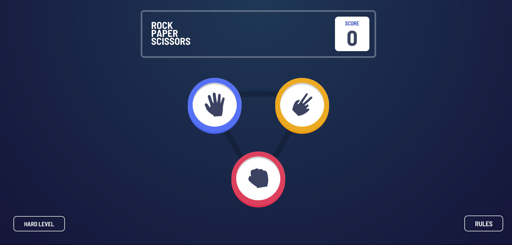

# Frontend Mentor - Rock, Paper, Scissors solution

This is a solution to the [Rock, Paper, Scissors challenge on Frontend Mentor](https://www.frontendmentor.io/challenges/rock-paper-scissors-game-pTgwgvgH). Frontend Mentor challenges help you improve your coding skills by building realistic projects. 

## The challenge

Users should be able to:

- View the optimal layout for the game depending on their device's screen size
- Play Rock, Paper, Scissors against the computer
- Play Rock, Paper, Scissors, Lizard, Spock against the computer

## Links

- [Solution URL](https://your-solution-url.com)
- [Live Site URL](https://rock-paper-scissors-developingweb.vercel.app)

## Built with

- Semantic HTML5 markup
- CSS custom properties
- Flexbox
- Mobile-first workflow

## Author

- Frontend Mentor - [@developingWeb](https://www.frontendmentor.io/profile/developingWeb)
